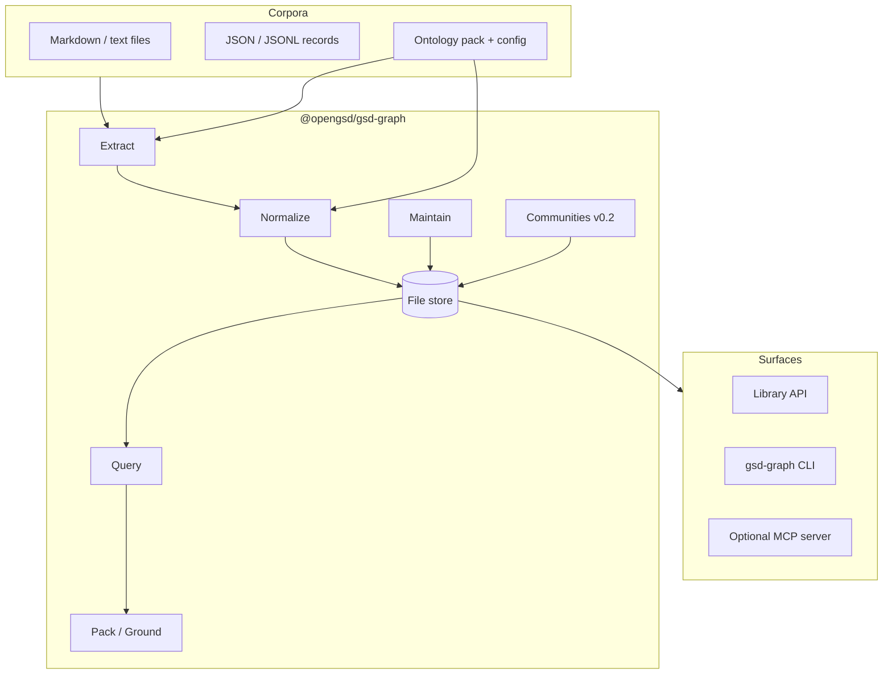
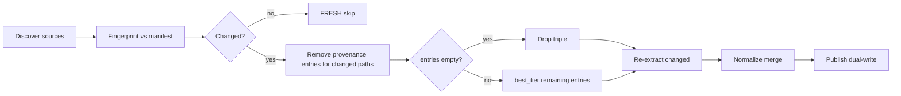

# Design: gsd-graph — Standalone Graph Engineering System

| Field | Value |
|-------|-------|
| **Document** | System design for `@opengsd/gsd-graph` |
| **Author** | Jeremy McSpadden \<jeremy@fluxlabs.net\> (OpenGSD org namespace) |
| **Copyright** | Copyright (c) 2026 Jeremy McSpadden \<jeremy@fluxlabs.net\>. Design for `open-gsd/gsd-graph`. |
| **Status** | Draft — standalone product pivot (review pass applied) |
| **Date** | 2026-08-02 |
| **Repo** | `/Users/jeremy/github/open-gsd/gsd-graph` (greenfield) |
| **Conceptual base** | Graph Engineering (GraphRAG-style pipelines: extract → normalize → query → ground → maintain) |
| **Audience** | Engineers implementing a general-purpose Graph Engineering toolkit |

---

## Overview

**gsd-graph** is a **standalone Graph Engineering system**: a TypeScript library, CLI, and optional MCP server that turns unstructured (and lightly structured) document corpora into a **queryable knowledge graph of relationships**, then answers multi-hop questions from **retrieved subgraphs with citations**—not from free-form retrieval of text chunks.

Regular RAG finds **text fragments**. Graph Engineering finds **relationships**: causation chains, themes, “what connects X to Y.” Microsoft GraphRAG, Stanford DSPy/STORM/KG scaling laws, and Anthropic’s graph + MCP patterns converge on the same thesis: **the right graph beats the bigger model.**

### Naming (K18 — frozen)

| Surface | Identifier | Meaning |
|---------|------------|---------|
| GitHub repo | `open-gsd/gsd-graph` | Repository home under the OpenGSD org |
| npm package | `@opengsd/gsd-graph` | **Publisher namespace only** (`@opengsd`); product is Graph Engineering |
| CLI binary | `gsd-graph` | Matches package/bin convention |
| Store directory | `.gsd-graph/` | Tool state folder; override with `--dir` / `store.dir` |
| On-disk engine field | `"gsd-graph"` | Store identity string for this implementation |

**OpenGSD is the publisher, not the runtime.** This package has **zero** runtime dependency on gsd-core, GSD workflows, or planning directories. npm description and README must lead with “Graph Engineering toolkit” and must **not** describe the package as a GSD capability or plugin. The `gsd-` stem is retained because the repo and org already use it; renaming the product surface mid-greenfield would fracture the only identity the project has without buying domain clarity (`.graph/` remains a supported **override**, not the default).

### Pipeline shape

This package owns:

**Extract → Normalize → Store → Query → Ground → Maintain**

**Store is a first-class pipeline stage** in this product (durable boundary). The pipeline’s **five prompt stages** (`extract`, `normalize`, `query`, `answer`, `maintain`) sit *inside* the corresponding stages; they are mechanisms, not the product. There is no separate “store prompt.”

Knowledge is stored as **triples** (subject–predicate–object) with confidence tiers and multiset provenance. Schema and deduplication remain human/review gated where zero-shot generation is unreliable. Storage is **local-first and file-based** under `.gsd-graph/` by default; no required cloud or graph database in v1. Optional Neo4j export and community (GraphRAG-style) reports are progressive sophistication.

OpenGSD product integration—if any—is deferred to a short future section only.

---

## Background & Motivation

### Why Graph Engineering

Classic RAG:

1. Chunk documents  
2. Embed / keyword index  
3. Retrieve top-k fragments for a query  
4. Ask an LLM to answer from fragments  

That works for “find me the paragraph about X.” It fails for:

| Question type | Why RAG fails | What the graph supplies |
|---------------|---------------|-------------------------|
| **Why** / causation | Fragments co-occur keywords, not chains | Multi-hop paths of typed edges |
| **How does A connect to B** | No structure between entities | Explicit paths / neighborhoods |
| **What are the themes** (global) | Local chunk similarity | Communities + community reports |
| **What changed** | Re-embed everything | Incremental triple invalidation |

The framing (aligned with GraphRAG research, relational memory results, and production graph+LLM case studies):

> LLM knows words. Knowledge graph knows relationships. The most powerful systems use both.

### Full pipeline (concept → product)

| Stage | Concept intent | gsd-graph realization |
|-------|----------------|----------------------|
| **1. Extraction** | Entities + relations from unstructured text | Deterministic parsers + optional LLM extract prompts → candidate nodes/triples |
| **2. Normalization** | Dedup, canonicalize, ontology alignment | ID canonicalization, alias merge, predicate allowlist, review queue for schema/dedup |
| **3. Graph query** | NL or structured → traversal | Structured Query IR: term/path/neighborhood/filter. **Article Prompt 3 (NL→graph query) is a known v0.1 gap** — agents use CLI/MCP structured args instead |
| **(Store)** | (implied durable graph) | **First-class stage** in this product: dual-write file store, lock, snapshots |
| **4. Grounded answer** | LLM answers only from subgraph + citations | Offline pack + deterministic cite render; optional LLM prose from pack only |
| **5. Maintenance** | Incremental updates, invalidation, human review | Source fingerprints, multiset provenance, build lock, snapshots |

**Five prompts** live under `prompts/` and drive optional LLM stages (see Prompt-mode contract). They are not the product; the graph and pipeline are.

### Problem this package solves

Builders of agent systems, personal knowledge bases, research workflows, and engineering intelligence tools repeatedly reimplement:

- Ad-hoc JSON “graphs” without provenance  
- RAG that cannot answer multi-hop “why”  
- Unattended LLM ontology invention that drifts  
- Session-only context that forgets structure  

**gsd-graph** ships one offline-capable toolkit with a stable store format, query API, grounded pack contract, and MCP surface so agents retain graph access across sessions without re-ingesting the corpus.

---

## Goals & Non-Goals

### Goals (v1)

1. Own a complete Graph Engineering pipeline in TypeScript (extract → normalize → store → query → ground → maintain).  
2. Ship **library + CLI** for local use; **optional MCP** for durable agent tool access.  
3. Represent knowledge as versioned **triples** with confidence + multiset provenance.  
4. Support **domain-configurable ontologies**: closed allowlist *within* a loaded ontology pack; ship a **general** default pack + 1–2 example packs.  
5. Ingest corpora: Markdown, plain text, optional JSON/JSONL records (path/glob based).  
6. Multi-hop local queries and **subgraph packs** with mandatory triple citations.  
7. Offline-first: deterministic extract + deterministic answer render without API keys; LLM stages opt-in.  
   **Offline GA success bar:** multi-hop “why” goldens use **link-structured Markdown and/or JSONL** corpora (wiki-links, definition lists, explicit edge records)—not free-prose LLM extraction. Free-prose multi-hop quality is `--llm` / post-0.1.  
8. Review gates for schema drift and ambiguous entity merges.  
9. Incremental maintenance with source fingerprints and crash-safe publish.  
10. Laptop-local performance budgets (see Observability).  
11. Golden scenario tests that prove relationship answers beat “keyword dump” baselines on deterministic-extractable fixtures.  

### Non-Goals (v1)

- Required Neo4j, managed graph cloud, or embedding SaaS.  
- Training or fine-tuning models.  
- Perfect zero-shot ontology invention without review.  
- Full code AST / symbol graph product (may add an optional adapter later).  
- **GSD Core workflow integration** (capabilities, phase loops, graphify migration) as product scope.  
- Hosted multi-tenant service.  
- Competing with specialized RAG frameworks feature-for-feature (chunk stores, hybrid search rankers).  

---

## Article → feature mapping

| Article concept | gsd-graph feature |
|-----------------|-------------------|
| RAG finds text; GE finds relationships | Query/path/pack over triples, not chunk cosine-only |
| Knowledge as S–P–O triples | Canonical store `triples[]` + node registry |
| Extraction | `pipeline/extract` + `prompts/extract.md` |
| Normalization | `pipeline/normalize` + review queue + ontology pack |
| Graph query | `query` / `path` / `neighborhood` / `filter` |
| Grounded answer | `packSubgraph` + `answer` (deterministic default) |
| Maintenance | Incremental build, provenance invalidation, snapshots |
| Schema + dedup need humans | `review-queue.json`; never auto-apply new predicates/types in strict mode |
| Community / global themes | Pure-TS label propagation + reports (v0.2) |
| Five prompts as mechanisms | Versioned `prompts/*.md` inside stages |
| MCP permanent access | Optional `gsd-graph-mcp` stdio tools |
| Right graph > bigger model | Ontology packs + confidence budgets over model size knobs |
| LaunchNotes-style intelligence | Example **engineering** ontology pack (issues, PRs, services—generic, not GSD-specific) |

---

## Proposed Design

### High-level architecture



### Package shape

**npm:** `@opengsd/gsd-graph`  
**Version:** start `0.1.0` (semver independent)  
**Runtime:** Node `>=22`  
**Language:** TypeScript → dual-friendly CJS+ESM if cheap; **CJS + types minimum** for broad tooling  
**License:** MIT  

#### Repo layout

```text
gsd-graph/
├── package.json
├── tsconfig.json
├── tsconfig.build.json
├── README.md
├── LICENSE
├── bin/
│   ├── gsd-graph.js           # CLI
│   └── gsd-graph-mcp.js       # optional MCP
├── src/
│   ├── index.ts               # public library exports
│   ├── cli.ts
│   ├── pipeline/
│   │   ├── extract.ts
│   │   ├── normalize.ts
│   │   ├── store.ts
│   │   ├── query.ts
│   │   ├── pack.ts
│   │   ├── answer.ts
│   │   ├── maintain.ts
│   │   └── communities.ts    # v0.2
│   ├── ontology/
│   │   ├── types.ts
│   │   ├── load-pack.ts
│   │   └── migrate.ts           # schema_version bumps only in v0.1 (no pack composition)
│   ├── sources/
│   │   ├── discover.ts
│   │   ├── markdown.ts
│   │   ├── text.ts
│   │   ├── jsonl.ts
│   │   └── fingerprint.ts
│   ├── llm/
│   │   ├── provider.ts        # none | prompt | http
│   │   └── budget.ts
│   ├── io/
│   │   ├── paths.ts
│   │   ├── lock.ts
│   │   ├── atomic-publish.ts
│   │   └── safe-json.ts
│   └── mcp/
│       └── server.ts
├── ontology-packs/
│   ├── general/               # default
│   │   ├── ontology.json
│   │   └── README.md
│   ├── research/              # example: papers, claims, authors
│   └── engineering/           # example: services, incidents, decisions
├── schemas/
│   ├── graph-v1.schema.json
│   ├── ontology-pack.schema.json
│   ├── provenance.schema.json
│   └── review-queue.schema.json
├── prompts/
│   ├── extract.md             # v0.1 LLM-assist (PR-12)
│   ├── normalize.md           # v0.1 LLM-assist (PR-12)
│   ├── query.md               # reserved post-0.1 (NL→IR); v0.1 may hold “explain QueryIR” only
│   ├── answer.md              # v0.1 (PR-11)
│   └── maintain.md            # v0.1 maintain diagnostics / repair suggestions (PR-09/12)
├── tests/
│   ├── fixtures/
│   │   └── golden/            # deterministic multi-hop corpora for G0–G4
│   └── *.test.ts
└── docs/
    └── DESIGN.md              # this document
```

**Copyright header** on every source file:

```ts
// gsd-graph — <file purpose>
// Copyright (c) 2026 Jeremy McSpadden <jeremy@fluxlabs.net>
```

### Storage layout (file-first)

**Default project root directory:** `.gsd-graph/`  
**Rationale:**

- Visible, conventional “tool state” folder (similar to `.git`, `.cache`)  
- Does not claim any host product’s planning directory  
- Easy to gitignore or commit as a team chooses  
- Override via `--dir` / `GSD_GRAPH_DIR` / config `store.dir`

```text
.gsd-graph/
├── config.json                 # project-local settings (optional)
├── ontology.lock.json          # resolved pack snapshot (types + predicates)
├── graph.v1.json               # CANONICAL source of truth
├── graph.json                  # disposable projection (nodes/edges) for simple consumers
├── sources.manifest.json       # path → content_hash, mtime, last_extracted_at
├── review-queue.json
├── .build.lock
├── snapshots/
│   └── <iso>-<name>.json
├── communities/                # v0.2
│   └── community-*.md
├── GRAPH_REPORT.md             # human summary (minimal in v0.1)
└── .last-build-status.json     # operator status for hooks/CI
```

#### Invariant: projection is disposable; v1 is truth

1. **`graph.v1.json`** is the only authoritative store. **Native library/CLI/MCP query paths never read `graph.json`.**  
2. **`graph.json`** is an optional disposable projection for external simple viewers.  
3. **v0.1 default:** write projection on successful publish (cheap, tested). Config `store.write_projection: false` skips step 4 for smaller critical path; `gsd-graph repair` regenerates projection on demand.  
4. If v1 missing/corrupt: fail with `schema_invalid`; do not invent graph from projection alone.

#### Dual-write publish protocol

All writers (CLI, library, MCP) share `.build.lock`.

```text
1. Acquire .build.lock
2. Validate in-memory graph against schema (+ soft/hard size caps)
3. Write graph.v1.json.tmp → fsync
4. If write_projection: Project edges → graph.json.tmp → fsync
5. Write manifest / review-queue / report temps as needed
6. Atomic rename: v1 first, then projection (if any), then sidecars
7. Write .last-build-status.json { status: ok|failed, reason, ... }
8. Release lock
```

Crash after v1 rename, before projection rename: readers use v1 only; projection may lag until repair/next build.

#### Build locking

| Item | Spec |
|------|------|
| Path | `<store>/.build.lock` |
| Contents | `{ pid, started_at, owner: "cli\|lib\|mcp", cwd }` |
| Stale | 15 minutes or dead PID → steal with warning |
| Contention | Default fail-fast `build_locked`; optional `--wait <sec>` |
| Status | `build_in_progress: true` when live lock held |

---

### Ontology model (domain-configurable)

v1 does **not** hard-code a single product domain. Instead:

#### Ontology pack

```json
{
  "id": "general",
  "version": "1",
  "title": "General knowledge",
  "node_types": ["Entity", "Person", "Organization", "Place", "Concept", "Document", "Event", "Claim", "Topic", "Community"],
  "predicates": [
    { "id": "related_to", "domain": ["*"], "range": ["*"] },
    { "id": "mentions", "domain": ["Document", "Claim"], "range": ["*"] },
    { "id": "part_of", "domain": ["*"], "range": ["*"] },
    { "id": "derived_from", "domain": ["*"], "range": ["Document"] },
    { "id": "causes", "domain": ["Event", "Claim", "Concept"], "range": ["Event", "Claim", "Concept"] },
    { "id": "supports", "domain": ["Claim", "Document"], "range": ["Claim"] },
    { "id": "contradicts", "domain": ["Claim"], "range": ["Claim"] },
    { "id": "located_in", "domain": ["Place", "Organization", "Person"], "range": ["Place"] },
    { "id": "works_for", "domain": ["Person"], "range": ["Organization"] },
    { "id": "authored", "domain": ["Person", "Organization"], "range": ["Document", "Claim"] },
    { "id": "about", "domain": ["Document", "Event", "Claim"], "range": ["Topic", "Concept", "Entity"] },
    { "id": "member_of", "domain": ["*"], "range": ["Community", "Organization"] },
    { "id": "precedes", "domain": ["Event"], "range": ["Event"] },
    { "id": "same_as", "domain": ["*"], "range": ["*"] }
  ],
  "strict": true,
  "unknown_predicate_policy": "review",
  "unknown_type_policy": "review"
}
```

#### Unknown type/predicate policy matrix (normative — no “or”)

Pack fields `unknown_predicate_policy` and `unknown_type_policy` ∈ `{ "review", "coerce", "drop" }`.  
`strict` defaults both to **`review`** when omitted. **Never silently expand `ontology.lock.json`.**

| `strict` | policy | Graph write | Review queue | Lockfile |
|----------|--------|-------------|--------------|----------|
| true (default) | `review` | **Do not** write the unknown triple/type node as proposed | Yes (`predicate_unknown` / `type_unknown`) | unchanged |
| true | `coerce` | Rewrite predicate→`related_to` or type→`Concept`; write with diagnostic | Optional flag item (non-blocking) | unchanged |
| true | `drop` | Discard candidate | Diagnostic only | unchanged |
| false | `coerce` (default when non-strict) | Open fallback types/predicates as above | diagnostics | unchanged |
| false | `review` / `drop` | as table | as table | unchanged |

Ontology **extension** (new allowlisted type/predicate in lock) requires explicit `gsd-graph review accept <id> --extend-ontology` or non-strict pack authoring offline—not ambient accept.

#### Pack composition (K19)

**v0.1 is replace-only:** one active pack path/id per project. No `extends` / merge of multiple packs. Workflow: copy `ontology-packs/general/ontology.json` → edit → `--ontology path`.  
`migrate.ts` handles **graph `schema_version` only**, not pack composition.

**Example packs (shipped, not exclusive):**

| Pack | Extra types (examples) | Extra predicates (examples) |
|------|------------------------|-----------------------------|
| `research` | Paper, Author, Method, Dataset | cites, evaluates, uses_method |
| `engineering` | Service, Incident, Decision, Change, API | depends_on, owns, mitigates, deploys |

Users can author packs under `.gsd-graph/ontology.pack.json` or `--ontology path`. On build, resolved pack is frozen to `ontology.lock.json` (hash of pack content + version).

#### Node identity & stable ids (K20)

**Slug algorithm:**

1. NFKC normalize  
2. Unicode lowercase  
3. Replace each run of non-alphanumeric with `-`  
4. Trim leading/trailing `-`  
5. If empty → `unnamed`  
6. Collision within same `type`: append `-2`, `-3`, …  

**Canonical node id:** `type:slug` (e.g. `person:ada-lovelace`).

**Triple id (stable across rebuilds):**  
`t_` + first 16 hex chars of `sha256(s + "\0" + p + "\0" + o)` (UTF-8). Citations and review items reference this id.

**Aliases:** `aliases[]` is an array of *normalized label strings* (same slug rules without type prefix).  
**Auto-merge (v0.1):** only when **exact** match of canonical id **or** exact normalized alias within the **same type**. No fuzzy/Levenshtein auto-merge. Cross-type (`person:ada` vs `concept:ada`) **never** auto-merges.  
**`same_as` predicate:** advisory edge only until a review `entity_merge` accept promotes an alias/id rewrite. Emitting `same_as` does not merge nodes by itself.

#### Confidence

| Tier | Meaning | Rank (higher = better) |
|------|---------|------------------------|
| `EXTRACTED` | Explicitly supported by source structure or verified quote span | 2 |
| `INFERRED` | Heuristic or LLM without hard quote proof | 1 |
| `AMBIGUOUS` | Conflicting or low-signal | 0 |

Shared total order for `best_tier`, budget drop (worst first), and `confidenceMin` filter (`rank(c) >= rank(min)`).

| Field | Rule |
|-------|------|
| `confidence` on triple | **Derived**: best tier among provenance entries |
| `score` | Optional 0–1; max of entry scores; **not** used as tier string |
| `ProvenanceEntry.confidence` | **Required** at emit time |

```ts
interface ProvenanceEntry {
  source_path: string;
  extractor: string;
  content_hash: string;
  confidence: 'EXTRACTED' | 'INFERRED' | 'AMBIGUOUS';
  score?: number;
  span?: { start_line?: number; end_line?: number };
}
```

---

### Canonical data model (`graph.v1.json`)

```json
{
  "schema_version": 1,
  "engine": "gsd-graph",
  "engine_version": "0.1.0",
  "ontology_pack_id": "general",
  "ontology_version": "1",
  "built_at": "2026-08-02T12:00:00.000Z",
  "built_at_commit": null,
  "nodes": [
    {
      "id": "concept:graph-engineering",
      "type": "Concept",
      "label": "Graph Engineering",
      "description": "…",
      "aliases": ["GE", "knowledge graph engineering"]
    }
  ],
  "triples": [
    {
      "id": "t_…",
      "s": "document:intro-graph-engineering",
      "p": "about",
      "o": "concept:graph-engineering",
      "confidence": "EXTRACTED",
      "score": 1.0,
      "provenance": [
        {
          "source_path": "corpus/article.md",
          "extractor": "markdown/heading",
          "content_hash": "sha256:…",
          "confidence": "EXTRACTED"
        }
      ]
    }
  ],
  "communities": [],
  "stats": { "node_count": 0, "triple_count": 0 }
}
```

Optional `built_at_commit`: if cwd is a git repo and user enables `stamp_git_commit: true`, store full hex hash only matching `/^[0-9a-f]{4,40}$/i` (argv injection fence).

#### Edge projection (for `graph.json` and term query)

```ts
{
  source: triple.s,
  target: triple.o,
  relation: triple.p,
  label: triple.p,
  confidence: triple.confidence,
  id: triple.id
}
```

`links` is never written by native publish; accepted on import of foreign graphs.

---

### Pipeline stages

#### 1. Extract

**Inputs:** configured globs (default `**/*.{md,txt,markdown}` under a user-supplied `--corpus` root; never walk the whole FS without roots).

**Deterministic extractors (default on, no LLM):**

| Source kind | Strategy | Typical triples |
|-------------|----------|-----------------|
| Markdown | H1/H2 hierarchy → Document/Topic; wiki-links `[[X]]`; markdown links; definition lists `Term : definition`; lines `A -causes-> B` / `A depends_on B` (allowlisted predicates); `#tags` | `document about topic`, `mentions`, **typed edges when link/grammar present** |
| Plain text | Paragraph windows; weak keyword mentions only | `document mentions concept` (**INFERRED**); **no** reliable multi-hop causation offline |
| JSON/JSONL | Field map: `{ id, type, label, edges: [{p, o}] }` | EXTRACTED structured facts — preferred for golden multi-hop |

**Offline honesty:** Free-prose paragraphs alone are **not** expected to yield typed causation chains without `--llm`. Multi-hop offline GA (G1) requires wiki-links, explicit edge lines, definition-list structure, and/or JSONL.

**Path safety:** realpath + prefix for corpus roots, store dir, `--ontology` path, prompt bundle paths, snapshot names (reject `..` and symlink escape). Soft caps: max source file **8 MiB** (skip+diagnostic); hard fail build if nodes > **100_000** or triples > **250_000** (`limit_exceeded`). Best-effort secret redaction in deterministic extract: patterns resembling `sk-…`, `AKIA…`, `-----BEGIN .* PRIVATE KEY-----` → do not emit as node labels/descriptions (replace with `[REDACTED]`).

**LLM extract (opt-in):** `llm.mode = prompt | http`, flag `--llm`. Chunk by token budget; `prompts/extract.md` returns JSON triples constrained to active ontology pack; fail-closed schema validation. Default entry confidence `INFERRED` unless quote span verified → `EXTRACTED`.

```ts
interface ExtractResult {
  nodes: GraphNode[];
  triples: Triple[];
  diagnostics: { path: string; code: string; message: string }[];
}
```

#### 2. Normalize

1. Canonicalize ids (`type:slug` per K20)  
2. Auto-merge **only** exact same-type alias/id matches; else `entity_merge` review candidate  
3. Apply unknown type/predicate policy matrix (above)  
4. Dedup `(s,p,o)`: **union provenance multiset**, re-derive `confidence`/`score` via best_tier  
5. Emit review items for remaining conflicts  

#### Review queue (normative schema)

File: `review-queue.json`

```json
{
  "schema_version": 1,
  "items": [
    {
      "id": "rv_a1b2c3d4",
      "kind": "entity_merge",
      "status": "pending",
      "created_at": "2026-08-02T12:00:00.000Z",
      "updated_at": null,
      "payload": {
        "keep_id": "person:ada-lovelace",
        "drop_id": "person:ada",
        "reason": "exact_alias_candidate_needs_confirm",
        "candidate_triple_ids": []
      },
      "decision": null
    }
  ],
  "decisions": []
}
```

**Item id:** `rv_` + first 8 hex of `sha256(kind + "\0" + stable_payload_canonical_json)`. Stable across rebuilds for same conflict → avoids re-queue loops when `status` is `accepted`/`rejected` (recorded under `decisions[]`).

| kind | payload (required fields) | `accept` effect | `reject` effect |
|------|---------------------------|-----------------|-----------------|
| `entity_merge` | `keep_id`, `drop_id` | Rewrite all triples s/o from drop→keep; merge aliases; delete drop node | Keep both; record decision; do not re-open unless payload changes |
| `predicate_unknown` | `proposed_p`, `triple` draft | With `--extend-ontology`: add predicate to lock + write triple; else require coerce or fail accept | Drop draft triple |
| `type_unknown` | `proposed_type`, `node` draft | With `--extend-ontology`: add type + write; else coerce to Concept on accept-coerce | Drop draft node |
| `schema_drift` | `detail` | Manual only / docs | Dismiss |

**Privileged mutations:** `reviewResolve` / CLI `review accept|reject` are the only write APIs for queue decisions. MCP exposes **list only** by default; accept/reject require `mcp.allow_review_write: true`. Library callers are same code path with no ambient auto-accept.

#### 3. Store

Dual-write publish protocol; update `sources.manifest.json`; optional minimal `GRAPH_REPORT.md` (counts + top predicates).

#### 4. Query

| Mode | API | v0.1 |
|------|-----|------|
| term seed+expand | `query({ term, hops?, budget? })` | yes |
| path | `query({ path: { from, to, maxDepth } })` | yes |
| neighborhood | `query({ id, hops })` | yes |
| filter | `query({ types?, predicates?, confidenceMin? })` | yes — enumerated fields only |
| NL→IR | **known v0.1 gap** | **out of v0.1** — use structured CLI/MCP args (NL→query prompt deferred) |

**Budget:** estimate tokens as `ceil(JSON.stringify(subgraph).length / 4)`; drop triples by tier worst-first **AMBIGUOUS → INFERRED → EXTRACTED** (rank order); always retain seed nodes when possible.

```ts
type QueryIR =
  | { op: 'seed_expand'; term: string; hops: number }
  | { op: 'path'; from: string; to: string; maxDepth: number }
  | { op: 'neighborhood'; id: string; hops: number }
  | { op: 'filter'; types?: string[]; predicates?: string[]; confidenceMin?: Confidence };
```

#### 5. Grounded answer = pack + optional NL

**`packSubgraph` is a composition of public query ops (K21):**

```text
defaults: hops = config.query.default_hops ?? 2
          k_seeds = 5
          budget = opts.budget ?? config.query.default_budget

1. Tokenize question:
   - lower case; split on non-alphanumeric
   - drop stopwords: {a,an,the,and,or,of,to,in,on,for,why,how,what,is,are,did,does,do}
   - tokens length ≥ 2 keep
2. Score each node: sum over tokens of
   +3 if token is full substring of normalized label
   +1 if token is substring of description
   +2 if token matches an alias
3. seeds = top k_seeds nodes by score (ties: shorter label, then id asc); drop score 0
4. expanded = seed_expand for each seed label/id with hops; union nodes/triples
   (implementation may call query({ term: seed.label, hops }) or internal seedAndExpand)
5. If ≥2 seeds: for each pair among top min(3, k_seeds) seeds, run path maxDepth=hops+2;
   keep shortest path(s) with fewest edges; union into pack.paths and path triples
6. applyBudget on union triples (confidence tier order); recompute reachable nodes
7. citations = all remaining triples with triple_id + source_path from first provenance entry
8. If no triples → empty pack (answer will abstain)
```

G1 asserts: `paths[]` contains at least one path with **≥ 3 nodes** (≥ 2 edges) and includes a required fixture predicate (e.g. `causes` or `depends_on`)—not merely a large neighborhood dump.

**Split APIs:**

```ts
interface SubgraphPack {
  question: string;
  seeds: string[];
  nodes: GraphNode[];
  triples: Triple[];
  paths: { nodes: string[]; predicates: string[] }[];
  citations: {
    triple_id: string;
    s: string; p: string; o: string;
    source_path?: string;
  }[];
  trimmed: string | null;
  budget_tokens: number | null;
}

interface GroundedAnswer {
  pack: SubgraphPack;
  answer_markdown: string;
  mode: 'deterministic' | 'prompt_pending' | 'http' | 'abstain';
  abstained: boolean;
  abstain_reason?: string;
  prompt_bundle?: object;
}

function packSubgraph(opts: PackOptions): SubgraphPack;
function answer(opts: AnswerOptions): GroundedAnswer;
```

**Deterministic render:** Seeds; Relationships (`s —p→ o` + `triple_id`); Paths; Citations. Empty triples → abstain `empty_subgraph`.

This is the product differentiator vs RAG: **answers are structurally bound to triples.**

#### 6. Maintain



**Unit matrix (required tests M1–M5):**

| Case | Setup | Expect |
|------|-------|--------|
| M1 | Two entries EXTRACTED + INFERRED; drop EXTRACTED source | Triple remains; confidence INFERRED |
| M2 | Drop both sources | Triple gone |
| M3 | Single EXTRACTED; drop path | Triple gone |
| M4 | Two EXTRACTED different paths; drop one | Triple remains; EXTRACTED |
| M5 | Dedup merge mixed tiers | Triple confidence EXTRACTED if any entry is |

Full rebuild (`build --full`) is authoritative after ontology/extractor changes.

#### 7. Communities (v0.2, post-GA)

- Pure TypeScript **label propagation** (no native deps), max 20 iterations, min size 3  
- Undirected projection of EXTRACTED+INFERRED edges  
- Deterministic community reports; LLM prose opt-in  
- Not a v0.1 release gate  

---

### LLM provider model + prompt-mode contract (five prompts)

| Mode | Behavior |
|------|----------|
| `none` | Default — deterministic extract + deterministic answer |
| `prompt` | File exchange bundles for host agent; apply validated JSON |
| `http` | Optional OpenAI-compatible endpoint from config |

LLM never runs ambiently; requires config + explicit CLI/API flag.

#### Unified prompt file exchange

Templates live in package `prompts/*.md`. Runtime I/O under store dir (realpath-confined):

| Stage | Template | Request file | Result file | Apply CLI |
|-------|----------|--------------|-------------|-----------|
| extract | `prompts/extract.md` | `.prompt-extract.json` | `.prompt-extract-result.json` | `build --apply-prompt extract` or `gsd-graph prompt apply extract` |
| normalize | `prompts/normalize.md` | `.prompt-normalize.json` | `.prompt-normalize-result.json` | `prompt apply normalize` |
| query | `prompts/query.md` | reserved | reserved | **v0.1: not applied** (NL→IR post-0.1). Template may document “explain this QueryIR” only |
| answer | `prompts/answer.md` | `.prompt-answer.json` | `.prompt-answer-result.json` | `answer --apply-prompt-result` |
| maintain | `prompts/maintain.md` | `.prompt-maintain.json` | `.prompt-maintain-result.json` | `prompt apply maintain` (suggestions only; no silent graph rewrite) |

**Result validation (all stages):** JSON Schema; unknown predicates/types respect pack policy; answer stage additionally requires `cited_triple_ids ⊆ pack.triple ids`. Fail → `prompt_result_invalid`.

---

### CLI

```bash
gsd-graph init [--dir .gsd-graph] [--ontology general|path]   # writes config; adds .gsd-graph/ to .gitignore if present
gsd-graph build --corpus <path> [--full|--incremental] [--dir …] [--llm] [--wait N]
gsd-graph query <term> [--hops N] [--budget N]
gsd-graph path <from> <to> [--depth N]
gsd-graph pack "<question>" [--budget N]
gsd-graph answer "<question>" [--budget N] [--apply-prompt-result]
gsd-graph prompt apply <extract|normalize|maintain>
gsd-graph status
gsd-graph diff [--snapshot <name>]     # default: current vs latest auto snapshot / .last-diff-base
gsd-graph snapshot save|list|restore <name>
gsd-graph review list
gsd-graph review accept <id> [--extend-ontology]
gsd-graph review reject <id>
gsd-graph ontology show|validate [--pack path]
gsd-graph repair
gsd-graph export cypher|jsonl   # optional later
```

#### Machine contract (K22)

- **stdout:** JSON only for successful structured commands  
- **stderr:** human diagnostics / progress when TTY; structured error JSON line `{ "ok": false, "reason": "<code>", "message": "..." }`  
- **exit codes:** `0` ok; `1` usage; `2` operational failure (reason code set); `3` locked  

#### `diff` semantics (v0.1)

Compare **current `graph.v1.json`** to a baseline:

1. `--snapshot <name>` if provided  
2. else `snapshots/.last-diff-base.json` written at end of each successful build  
3. else error `no_baseline`

Return:

```ts
interface DiffResult {
  baseline: string; // path or name
  nodes: { added: string[]; removed: string[]; changed: string[] };
  triples: { added: string[]; removed: string[]; changed: string[] }; // by triple id
  counts: { nodes_added: number; nodes_removed: number; triples_added: number; triples_removed: number };
}
```

Node/triple “changed” = same id, different JSON payload (excluding volatile timestamps if any).

---

### Library API (public)

```ts
export function init(opts: InitOptions): void;
export function build(opts: BuildOptions): BuildResult;
export function query(opts: QueryOptions): QueryResult;
export function packSubgraph(opts: PackOptions): SubgraphPack;
export function answer(opts: AnswerOptions): GroundedAnswer;
export function status(opts: StoreOptions): StatusResult;
export function diff(opts: DiffOptions): DiffResult;
export function snapshotSave(opts: SnapshotSaveOptions): SnapshotResult;
export function snapshotList(opts: StoreOptions): SnapshotInfo[];
export function snapshotRestore(opts: SnapshotRestoreOptions): SnapshotResult;
export function reviewList(opts: StoreOptions): ReviewItem[];
export function reviewResolve(opts: ReviewResolveOptions): void;
export function repair(opts: StoreOptions): RepairResult;
export function promptApply(opts: PromptApplyOptions): void;

export { seedAndExpand, applyBudget, buildAdjacencyMap } from './pipeline/query';
```

#### StatusResult (normative core)

```ts
interface StatusResult {
  exists: boolean;
  store_dir: string;
  engine: 'gsd-graph';
  schema_version?: number;
  ontology_pack_id?: string;
  node_count?: number;
  triple_count?: number;
  edge_count?: number;
  last_build?: string;
  stale?: boolean;              // mtime or policy
  age_hours?: number;
  build_in_progress?: boolean;
  review_queue_count?: number;
  projection_stale?: boolean;
  last_build_status?: object | null;
  reason?: string | null;
}
```

#### Reason codes

```ts
const GSD_GRAPH_REASON = Object.freeze({
  OK: 'ok',
  BUILD_LOCKED: 'build_locked',
  BUILD_FAILED: 'build_failed',
  SCHEMA_INVALID: 'schema_invalid',
  ONTOLOGY_INVALID: 'ontology_invalid',
  EMPTY_SUBGRAPH: 'empty_subgraph',
  PROMPT_RESULT_INVALID: 'prompt_result_invalid',
  CORPUS_NOT_FOUND: 'corpus_not_found',
  PATH_ESCAPE: 'path_escape',
  LIMIT_EXCEEDED: 'limit_exceeded',
  NO_BASELINE: 'no_baseline',
});
```

---

### MCP surface (optional, same package)

stdio JSON-RPC tools:

| Tool | Maps to |
|------|---------|
| `graph_status` | status |
| `graph_query` | term / path / neighborhood / filter |
| `graph_pack` | packSubgraph |
| `graph_answer` | answer (deterministic or configured LLM) |
| `graph_review_list` | review queue (read) |
| `graph_review_resolve` | accept/reject — **off** unless `mcp.allow_review_write` |
| `graph_build` | **off by default**; enable with MCP server `--allow-build` |

Purpose: **permanent session access** to the graph without re-pasting reports—MCP as durable tool surface.

---

### Configuration

Project file `.gsd-graph/config.json` (and/or flags):

```json
{
  "store": { "dir": ".gsd-graph", "write_projection": true },
  "corpus": { "roots": ["docs", "notes"], "globs": ["**/*.{md,txt,md,jsonl}"] },
  "ontology": {
    "pack": "general",
    "strict": true,
    "unknown_predicate_policy": "review",
    "unknown_type_policy": "review"
  },
  "build": { "timeout_sec": 300, "incremental": true },
  "query": { "default_hops": 2, "default_budget": null, "pack_k_seeds": 5 },
  "llm": { "mode": "none", "http": { "base_url": "", "model": "" } },
  "mcp": { "allow_review_write": false, "allow_build": false },
  "stamp_git_commit": false
}
```

---

### End-to-end sequence (fresh laptop, no API keys)

```text
1. npm i -g @opengsd/gsd-graph   # or npx
2. cd my-project && gsd-graph init
3. gsd-graph build --corpus ./notes --full
4. gsd-graph query "supply chain" --budget 2000
5. gsd-graph path person:alice organization:acme
6. gsd-graph pack "why did project X stall?"
7. gsd-graph answer "why did project X stall?"
8. gsd-graph status
```

---

## Security & Privacy

| Threat | Severity | Mitigation |
|--------|----------|------------|
| Path traversal / symlink escape | High | realpath + prefix on corpus, store, ontology, prompts, snapshots |
| Prompt injection via corpus → LLM | Medium | LLM opt-in; schema-validate outputs; never execute model output |
| Review / build mutations via MCP | Medium | Privileged: review write and build **off** by default on MCP |
| Git commit stamp injection | Medium | Hex-only commit fence if stamping enabled |
| Concurrent writers | High | `.build.lock` + dual-write protocol |
| MCP read exfiltration | Medium | Local stdio; same trust as reading store files |
| Secrets in corpus | Medium | Best-effort redaction patterns + docs; no network by default |
| Graph DoS (huge corpus) | Medium | Per-file 8 MiB skip; hard caps nodes/triples |

Privacy: local-first; no telemetry; no cloud unless user enables `llm.http`.

---

## Observability

| Metric | Target (laptop, mid corpus) |
|--------|------------------------------|
| Incremental build ≤10 changed files | ≤ 5s deterministic |
| Full build ≤200 medium MD files | ≤ 30s deterministic |
| Term query hops=2, ≤5k edges | ≤ 50ms |
| Path depth≤6 | ≤ 200ms |
| Pack (no LLM) | ≤ 100ms |
| Store size | warn at 50 MB `graph.v1.json`; hard fail over node/triple caps |

Logging: structured JSON lines to stderr on errors; build summary (sources, triples ±, duration, reason).

---

## Alternatives Considered

### Alt 1 — RAG-only product (chunks + embeddings)

| Pros | Cons |
|------|------|
| Familiar, fast to ship | Fails multi-hop/global relationship questions |

**Reject** as primary—relationships are the product.

### Alt 2 — Required Neo4j / graph DB

| Pros | Cons |
|------|------|
| Mature query languages | Ops burden; conflicts with local-first v1 |

**Defer** as optional export/backend.

### Alt 3 — Pure LLM “extract whole graph in one shot”

| Pros | Cons |
|------|------|
| Minimal code | Unreliable schema/dedup; no provenance; expensive |

**Reject**—LLMs assist stages; humans/gates on schema/dedup.

### Alt 4 — Domain-hardcoded ontology only (single vertical)

| Pros | Cons |
|------|------|
| Faster MVP for one niche | Blocks general toolkit goal |

**Reject** as sole model; ship packs instead (general default + examples).

### Alt 5 — Embeddings-first hybrid graph

| Pros | Cons |
|------|------|
| Strong entity linking | Embedding dependency; offline purity harder |

**Later**—v1 deterministic + optional LLM extract without required vectors.

---

## Test Strategy

| Suite | Focus |
|-------|-------|
| `ontology-pack.test` | load, strict `review` no-write, coerce path, lock freeze |
| `extract-markdown.test` | headings, links, edge lines, tags → triples |
| `normalize.test` | dedup, multiset union, best_tier, exact-alias merge only |
| `maintain.test` | M1–M5 provenance matrix |
| `query.test` | seed/expand, budget drop order, path, confidenceMin |
| `pack-answer.test` | pack=query composition, citations, abstain |
| `publish-lock.test` | dual-write order, lock contention |
| `diff.test` | ± nodes/triples vs snapshot baseline |
| `review-queue.test` | accept/reject effects, stable ids |
| `cli.test` | subcommands, exit codes, reason codes |
| `golden-scenarios.test` | G0–G4 under `tests/fixtures/golden/` |

### Golden scenarios (v0.1)

| ID | Scenario | Pass |
|----|----------|------|
| G0 | Plain paragraph-only corpus | Offline extract yields weak `mentions` INFERRED at most; pack for “why X” **abstains** or has no typed multi-hop path |
| G1 | Link/JSONL fixture with explicit `causes`/`depends_on` chain | `paths[]` length ≥1 with ≥3 nodes; citations include required predicate; offline no LLM |
| G2 | `path` between two entities in fixture | Non-empty path with typed predicates |
| G3 | Budget drops AMBIGUOUS before EXTRACTED | Order assertion |
| G4 | Incremental edit one source file | Other sources’ triples survive; edited provenance updates |

---

## Rollout Plan

1. **0.1.0** — init/build/query/path/pack/answer/status/diff/snapshot/review/repair; general ontology pack; no MCP required  
2. **0.2.0** — communities + richer GRAPH_REPORT; MCP server stabilized  
3. **0.3.0** — HTTP LLM polish; export cypher; optional embedding-assisted entity link  
4. **Later** — optional backends (SQLite/Neo4j), more ontology packs  

Feature flags are local config only (`llm.mode`, `ontology.strict`, etc.).

Rollback: `snapshot restore`; prior store files retained on failed publish.

---

## Future: OpenGSD integration (optional, non-blocking)

If OpenGSD products later consume this package:

- Depend on `@opengsd/gsd-graph` as a normal library  
- Map host artifacts into a custom ontology pack  
- Point `--corpus` / `--dir` at host-chosen paths  

**Out of scope for this design and for v1 PR plan:** gsd-core capability overlays, graphify facades, MemPalace coupling, REQ-GRAPH requirements, or assuming `.planning/` layout.  
**PR rule:** reject any PR that adds a runtime dependency on gsd-core or assumes `.planning/`.

---

## Open Questions

1. **ESM-only vs CJS dual package** for first publish — default **CJS+types** unless dual packaging is free.  
2. **Tutorial example pack** after general: research vs engineering first — non-blocking; general is mandatory.  
3. **Whether to enable `store.write_projection` by default long-term** if no external viewers emerge — can flip to lazy later without schema break.

*(Store dir name, MCP build default, and package naming are **decided** — see K18 / Naming / MCP sections.)*

---

## Key Decisions

| Decision | Choice | Rationale |
|----------|--------|-----------|
| **K1 — Product** | Standalone Graph Engineering toolkit, not a host-app subsystem | Graph Engineering pipeline is the product spine |
| **K2 — Pipeline** | Extract → Normalize → **Store** → Query → Ground → Maintain; five prompts inside stages (Store has no prompt) | Article + durable boundary |
| **K3 — Knowledge model** | Triples + nodes + multiset provenance | Relationships explicit and citable |
| **K4 — Storage** | File-first **`.gsd-graph/`**; `graph.v1.json` SoT; optional disposable `graph.json`; native APIs never read projection | Local-first; publisher naming consistency |
| **K5 — Ontology** | Configurable packs; closed allowlist within pack; **replace-only** (no extends) in v0.1; general default | General-purpose without open-world chaos |
| **K6 — Confidence** | Per-entry confidence; triple = best_tier(entries); shared rank order | Correct incremental invalidation + filter/budget |
| **K7 — LLM** | Optional (`none`/`prompt`/`http`); deterministic GA | Offline multi-runtime honesty |
| **K8 — Grounding** | `packSubgraph` + deterministic answer default | Citations without API keys |
| **K9 — Review gates** | Strict default `unknown_*_policy: review` (no write); full item schema + accept/reject effects | Article: zero-shot schema unreliable |
| **K10 — Query** | term/path/neighborhood/filter; **NL→IR is known gap** post-0.1 | Shippable surface |
| **K11 — Locking** | Shared `.build.lock` | Multi-writer safety |
| **K12 — Communities** | Pure-TS label propagation in v0.2 | Global questions without native deps |
| **K13 — DB backends** | No required graph DB; optional export later | Zero ops v1 |
| **K14 — MCP** | Optional; build/review-write off by default | Durable access without footguns |
| **K15 — Host coupling** | None in v1 | Clear product boundary |
| **K16 — Language** | TypeScript / Node ≥22 | Ecosystem fit |
| **K17 — Publish safety** | Dual-write protocol; projection optional via config | Crash consistency without mandatory complexity |
| **K18 — Naming** | Keep `@opengsd/gsd-graph`, CLI `gsd-graph`, dir `.gsd-graph/`; OpenGSD = publisher only | Repo/org identity; standalone mission in docs not rename churn |
| **K19 — Pack composition** | Replace-only v0.1; copy-pack to customize | Avoid merge complexity |
| **K20 — Id stability** | Slug NFKC rules; triple id = hash(s,p,o) | Stable citations across rebuilds |
| **K21 — Pack algorithm** | Composition of public query ops + k=5 seeds + path among top seeds | Testable multi-hop; G1 not gameable |
| **K22 — CLI machine contract** | JSON stdout; reasoned stderr; exit 0/1/2/3 | Agent-friendly |
| **K23 — Alias merge** | Auto-merge exact same-type only; `same_as` advisory | Prevent silent corruption |
| **K24 — Offline GA bar** | Multi-hop goldens require link/JSONL structure; free prose → G0 abstain | Honesty vs LLM |
| **K25 — Diff** | Current graph vs snapshot / last-diff-base; ± nodes & triples by id | Defined v0.1 surface |
| **K26 — Init gitignore** | `init` appends store dir to `.gitignore` when a gitignore exists | Default: treat store as derived |

---

## References

- Microsoft GraphRAG: https://github.com/microsoft/graphrag  
- LLM-assisted Knowledge Graph Engineering: https://arxiv.org/abs/2307.06917  
- Model Context Protocol: https://github.com/modelcontextprotocol  
- Stanford DSPy / STORM and related knowledge-graph scaling literature  
- This repo: `/Users/jeremy/github/open-gsd/gsd-graph`  

---

## PR Plan

All PRs are **this repo only**. Sizes: **S** small, **M** medium, **L** large.

### PR-01 — Bootstrap — **S**

- **Title:** `chore: bootstrap @opengsd/gsd-graph package`
- **Files:** package.json, tsconfigs, LICENSE, README, src/index.ts, CI  
- **Deps:** none  
- **Description:** Package metadata, build, copyright headers, Node ≥22.

### PR-02 — Schemas & ontology pack loader — **M**

- **Title:** `feat: graph-v1 schema, ontology packs, general pack`
- **Files:** schemas/*, ontology-packs/general/*, src/ontology/*  
- **Deps:** PR-01  
- **Description:** Pack validate/load/lock; policy matrix `review|coerce|drop`; replace-only packs.

### PR-03 — IO: paths, lock, dual-write — **M**

- **Title:** `feat: store paths, build lock, atomic dual-write`
- **Files:** src/io/*  
- **Deps:** PR-01  
- **Description:** realpath for all inputs; publish protocol; optional projection flag.

### PR-04 — Deterministic markdown/text extract + golden fixture seed — **M**

- **Title:** `feat: corpus discovery and deterministic extractors`
- **Files:** src/sources/*, extract.ts, `tests/fixtures/golden/` seed  
- **Deps:** PR-02, PR-03  
- **Description:** MD links/edge lines; G0/G1 corpus stubs; secret redaction; size caps.

### PR-05 — JSON/JSONL structured extract — **S**

- **Title:** `feat: JSON/JSONL structured source adapter`
- **Files:** src/sources/jsonl.ts, tests  
- **Deps:** PR-04  
- **Description:** Field map → EXTRACTED triples for multi-hop goldens.

### PR-06 — Normalize + review queue — **M**

- **Title:** `feat: normalize, multiset provenance, review queue accept/reject`
- **Files:** normalize.ts, review-queue schema, tests  
- **Deps:** PR-04  
- **Description:** exact-alias merge only; item schema; accept/reject effects; best_tier.

### PR-07a — Store publish + status — **M**

- **Title:** `feat: graph.v1 publish, status, last-build-status`
- **Files:** store.ts (publish path), status  
- **Deps:** PR-06, PR-03  
- **Description:** dual-write / optional projection; caps; reason codes.

### PR-07b — Snapshot, repair, diff baseline — **M**

- **Title:** `feat: snapshots, repair, diff vs baseline`
- **Files:** snapshot/*, diff.ts  
- **Deps:** PR-07a  
- **Description:** save/list/restore; repair projection; last-diff-base.

### PR-08 — Query engine — **M**

- **Title:** `feat: seed-expand, budget, path, neighborhood, filter`
- **Files:** query.ts, tests  
- **Deps:** PR-07a  
- **Description:** Multi-hop query; shared confidence rank; no NL→IR.

### PR-09 — Maintain incremental — **M**

- **Title:** `feat: fingerprints and provenance invalidation`
- **Files:** maintain.ts, fingerprint.ts, M1–M5 tests, prompts/maintain.md stub  
- **Deps:** PR-07a, PR-06, PR-04  
- **Description:** Incremental rebuild correctness.

### PR-10 — CLI core — **M**

- **Title:** `feat: gsd-graph CLI (init, build, query, path, status, diff, snapshot, review, repair, ontology)`
- **Files:** bin/gsd-graph.js, cli.ts  
- **Deps:** PR-08, PR-09, PR-07b  
- **Description:** K22 machine contract; init gitignore; no pack/answer yet.

### PR-11 — Pack + deterministic answer + CLI — **M**

- **Title:** `feat: packSubgraph as query composition, answer, CLI pack/answer`
- **Files:** pack.ts, answer.ts, prompts/answer.md  
- **Deps:** PR-08, PR-10  
- **Description:** K21 algorithm; prompt apply for answer; G1 path assertions.

### PR-12 — LLM prompt/http providers — **M**

- **Title:** `feat: optional LLM extract/normalize/answer providers + unified prompt apply`
- **Files:** src/llm/*, prompts/extract.md, normalize.md, query.md (reserved)  
- **Deps:** PR-04, PR-11  
- **Description:** Shared prompt file protocol; fail-closed schema. Optional for 0.1 tag.

### PR-13 — Minimal GRAPH_REPORT — **S**

- **Title:** `feat: GRAPH_REPORT.md summary writer`
- **Files:** report writer  
- **Deps:** PR-07a  
- **Description:** Counts + top predicates.

### PR-14 — MCP server — **M**

- **Title:** `feat: optional gsd-graph MCP tools`
- **Files:** mcp/*  
- **Deps:** PR-10, PR-11  
- **Description:** status/query/pack/answer; build/review-write off by default. Optional for 0.1.

### PR-15 — Example ontology packs + docs — **S**

- **Title:** `docs: research and engineering ontology pack examples`
- **Files:** ontology-packs/*, README naming callout  
- **Deps:** PR-02  
- **Description:** Domain configurability; not required to tag 0.1.

### PR-16 — Communities (v0.2) — **M**

- **Title:** `feat: label-propagation communities and reports`
- **Files:** communities.ts  
- **Deps:** PR-07a; after 0.1  
- **Description:** Global themes.

### PR-17 — Golden scenarios + 0.1.0 release — **M**

- **Title:** `test+release: golden G0–G4 and version 0.1.0`
- **Files:** tests/fixtures/golden/*, golden-scenarios.test, CHANGELOG  
- **Deps:** PR-06, PR-09, PR-10, PR-11, PR-13  
- **Description:** Offline multi-hop honesty; publish npm. No gsd-core deps.

```text
PR-01 ─┬─► PR-02 ─► PR-04 ─► PR-05
       │              │
       └─► PR-03 ─────▲
                      ▼
                    PR-06 ─► PR-07a ─┬─► PR-07b
                                    ├─► PR-08 ─► PR-11 ─► PR-17
                                    ├─► PR-09 ─────────▲
                                    └─► PR-13 ─────────▲
              PR-08+09+07b ─► PR-10 ─► PR-11 ─► PR-14 (opt)
              PR-04+11 ─► PR-12 (opt for 0.1)
              PR-02 ─► PR-15 (opt)
              post-0.1: PR-16
```

---

*End of design document.*
